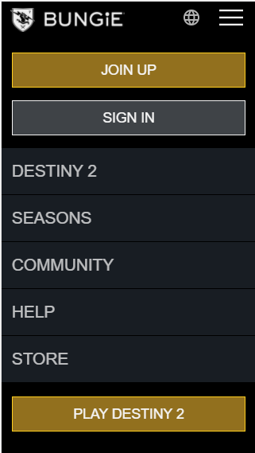
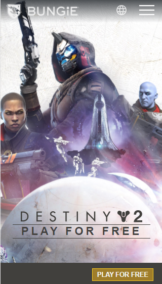
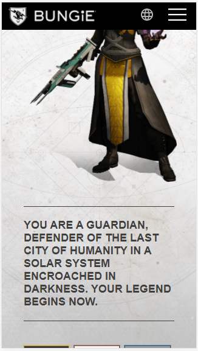
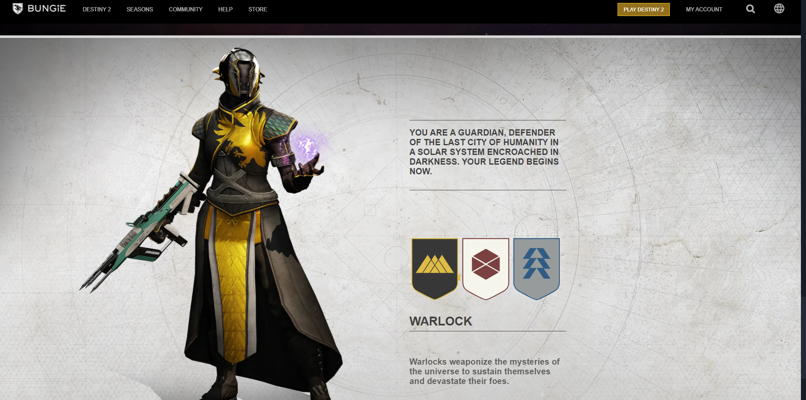
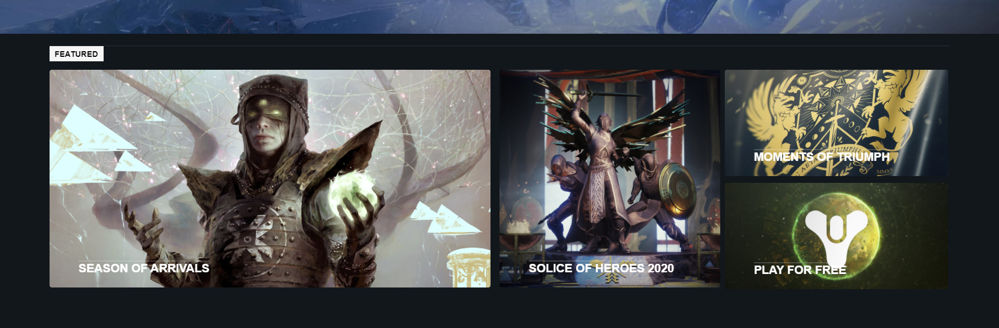
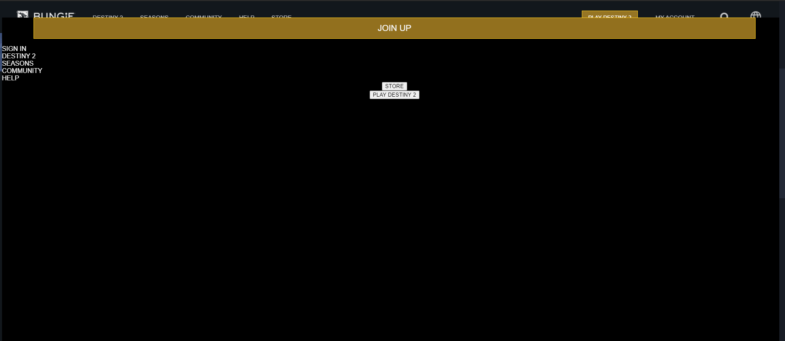
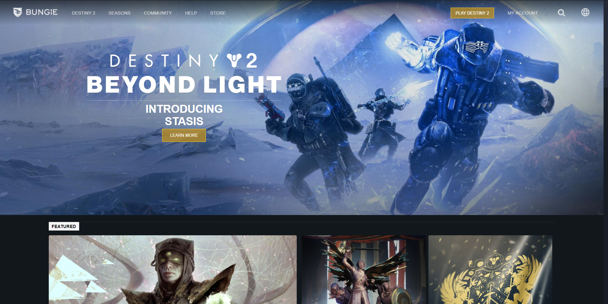
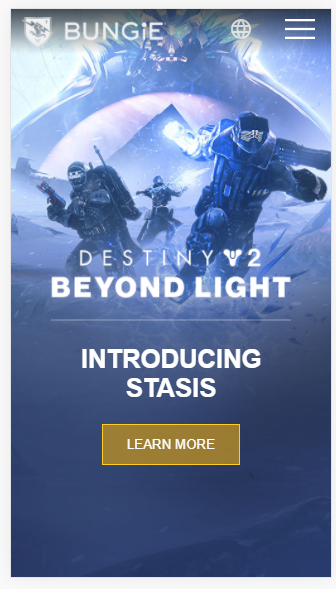
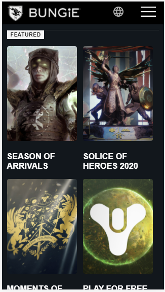
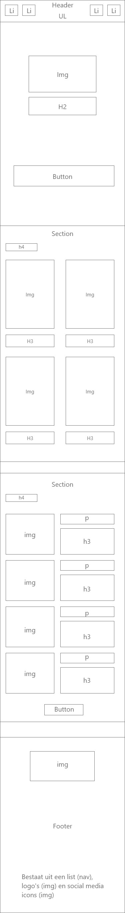

# Procesverslag
**Auteur:** Bas de Roller

Markdown cheat cheet: [Hulp bij het schrijven van Markdown](https://github.com/adam-p/markdown-here/wiki/Markdown-Cheatsheet). Nb. de standaardstructuur en de spartaanse opmaak zijn helemaal prima. Het gaat om de inhoud van je procesverslag. Besteedt de tijd voor pracht en praal aan je website.

## Bronnenlijst
1. https://www.bungie.net/

## Eindgesprek (week 7/8)

Ik ben erg blij met mijn eindresultaat. Het was best lastig om te werken zonder het veel gebruiken van classes en divs.
Soms kwam ik ook in de knoei met het gebruik van Nth-of-type en dat het bij meerdere elementen iets veranderde.
Verder is de javascript erg goed gelukt en daar ben ik erg blij mee.

**Screenshot(s):**

## Voortgang 3 (week 6)

### Stand van zaken

Gaat goed. Het ding waar ik vorige week een vraag over had is gelukt en ik ben nu bezig met het hamburger menu.

**Screenshot(s):**

### Agenda voor meeting

Ieder laat voor zich hun website zien. Dan kunnen mensen de vragen stellen die ze willen. Na die vragen kunnen we algemene vragen stellen.

### Verslag van meeting

---

## Voortgang 2 (week 5)

### Stand van zaken

Gaat goed. Ik wil volgende keer alleen ietjes meer af hebben. Heb nog wel een vraag straks voor bij het gesprek.

**Screenshot(s):**

### Agenda voor meeting

Ieder laat voor zich hun website zien. Dan kunnen mensen de vragen stellen die ze willen. Na die vragen kunnen we algemene vragen stellen.

### Verslag van meeting

Meeting ging lekker, Ik ben geholpen met mijn vraag.

## Voortgang 1 (week 3)

### Stand van zaken

Het maken van de website ging lekker, ik had wel wat meer moeite met verschillende soorten afmetingen (em, % enz)

**Screenshot(s):**

### Agenda voor meeting

Ieder laat voor zich hun website zien. Dan kunnen mensen de vragen stellen die ze willen. Na die vragen kunnen we algemene vragen stellen.

### Verslag van meeting

Werk gaat lekker.

## Intake (week 1)

Mijn startniveau: Rood / Zwart

Mijn focus: Responsive (en als dat kan beide)

De opdracht: https://www.bungie.net/

Screenshot(s):
Laptop:

Mobile:

Breakdown-schets(en):

Dit is de hoofdpagina:

Small screen

